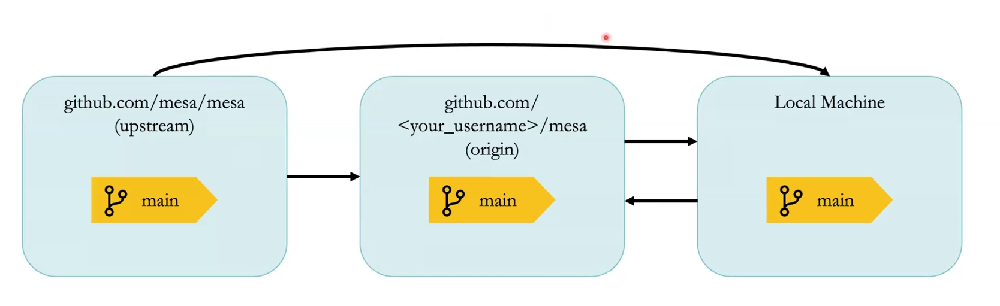

# 基于 Pareto 财富模型的 ABM 与 ABM 工作流入门

代理人基础模型（Agent-Based Model, ABM）强调从个体行为出发理解系统演化。在入门教学中，财富分配模型常被用作示例，因为它能够较为清晰地展示主体、规则、时间步推进与结果评价之间的关系。本文以 Pareto 财富模型为例，概括 ABM 的基本建模思路，并据此整理一个面向初学者的 ABM 工作流。

---

# 一、基于 Pareto 财富模型的 ABM

## 1. 模型背景

这一类财富模型的思想可以追溯到玻尔兹曼分布。设想在一个封闭空间中，粒子随机碰撞并交换能量，经过足够长的时间后，系统中的能量分布通常是不均匀的：大多数粒子处于较低能量状态，少数粒子拥有较高能量。

如果把这一思路转换到社会系统中，可以将“粒子”理解为“人”，将“能量”理解为“钱”或“财富”。问题随之变为：在个体初始财富相同、交易规则较为简单且具有随机性的条件下，经过反复互动后，财富分布会演化成什么样的状态。

这个示例的意义不在于完整解释现实经济系统，而在于说明 ABM 的一个核心特征：即便个体只遵循简单规则，系统层面也可能逐渐形成明显的不均等分布。

## 2. 评价指标：基尼系数

为了衡量模型中的财富分布变化，可以使用基尼系数。它是衡量收入或财富差距的常用指标，通常取值在 0 到 1 之间。

- 基尼系数越小，表示分配越平均。
- 基尼系数越大，表示分配越不平均。

在可视化上，基尼系数通常与洛伦兹曲线对应，用于描述累计人口占比与累计财富占比之间的关系。因此，在财富模型中持续追踪基尼系数，可以较为直观地观察不平等如何随着时间步推进而变化。

## 3. 具体建模思路

从建模流程看，这个示例可以概括为两个部分：初始化阶段与模拟循环。

### 3.1 初始化阶段

初始化时需要完成四项工作：创建模型、建立空间、放置主体，以及设置数据收集。

首先实例化 `MoneyModel`。其次建立网格空间，用于承载主体的位置与移动。随后创建若干个 `MoneyAgent`，并将其随机放置在网格中。每个主体的初始财富设为 1。最后初始化 `DataCollector`，用于跟踪基尼系数以及主体财富等指标。

### 3.2 模拟循环

在每一个时间步中，模型按照既定顺序推进。主体首先被随机调度，然后在网格中随机移动到相邻位置。之后发生交互：如果同一格子内存在其他主体，且当前主体拥有财富，则会随机给其中一个主体 1 单位财富。完成这一轮更新后，模型记录当前状态，并计算新的基尼系数。

## 4. 模型中的两个核心对象

### 4.1 MoneyAgent

在主体层面，`MoneyAgent` 至少包含两个状态属性：

- `wealth`：当前财富值，初始为 1；
- `cell`：当前所在的网格单元。

其核心行为包括两类：

- **移动（Move）**：从周围 8 个方向的邻居格子中随机选择一个目标单元并移动过去；
- **财富转移（Give Money）**：检查当前格子内是否存在其他主体；若自身财富大于 0，则随机选择一名主体，自己减少 1 单位财富，对方增加 1 单位财富。

在时间步逻辑中，主体通常按 `move()` 与 `give_money()` 的顺序执行。

### 4.2 Model

在系统层面，`Model` 主要负责以下任务：

- 初始化空间，例如使用网格结构；
- 批量创建 `MoneyAgent` 并赋予初始状态；
- 定义时间步更新机制，通过随机乱序模拟同步推进；
- 收集模型输出，其中 `model_reporters` 可记录基尼系数，`agent_reporters` 可记录财富值，用于后续绘图与分析。

## 5. 这个示例说明了什么

Pareto 财富模型作为 ABM 入门案例，重点不在于复杂行为设定，而在于清晰展示建模最基本的结构：主体如何定义、环境如何组织、规则如何运行，以及结果如何衡量。通过这个例子，可以较为直接地理解 ABM 的基本逻辑：从局部交互出发，观察宏观分布如何逐步形成。

## 6. 拓展思路

在基础财富模型之上，一个常见拓展方向是引入异质性主体。例如，为主体增加类型或颜色属性，并进一步让这种属性影响财富转移行为。这样一来，模型不再只是“随机交换财富”，而是能够表达“不同主体之间的差异化互动”。

这一拓展的重点不是增加字段本身，而是理解如何在 ABM 中沿着“属性—行为—参数—结果”这一链条对模型进行修改。

---

# 二、ABM 工作流入门

对于 ABM 项目而言，建模只是起点。一个可持续的开发过程还需要清晰的工作流，用于管理任务、代码变更、本地检查与协作提交。一个基础工作流可以整理为三个部分：准备阶段、开发阶段与提交阶段。

## 1. 第一部分：准备阶段

准备阶段的目标，是在真正开始修改代码之前明确任务，并完成本地开发环境搭建。

首先，需要找到一个适合处理的问题，通常来自仓库中的 issue 或 ticket。如果发现的是新问题，也可以自行创建 issue。对于初次参与贡献的开发者，带有 `good first issue` 标签的任务通常更适合作为起点。在开始之前，最好先确认该任务是否已经被他人认领，必要时与维护者沟通，避免重复工作。

接下来，需要完成仓库准备。常见做法是先 fork 原始仓库，再 clone 到本地机器。此时通常会涉及三个版本：原始仓库、本人的远程仓库，以及本地仓库。它们之间不会自动同步，因此需要理解 upstream、origin 与本地代码之间的关系，避免在后续开发中因同步问题引发混乱。

```{r, echo=FALSE, out.width="90%", fig.align="center"}


在 clone 完成后，不建议直接在主分支上开发，而应从主分支创建新的分支。分支名称可以与当前任务内容对应。随后，根据项目要求安装依赖项。实际开发中一般会在虚拟环境内完成安装，以保持环境隔离并减少依赖冲突。

## 2. 第二部分：开发阶段

开发阶段的核心是对目标内容进行修改，并在本地完成必要检查。

完成代码改动后，通常还需要同步补充相关内容，例如必要的文档、示例或测试。之后使用 Git 进行基本操作，如 `git add` 与 `git commit`。如果提交可以关联具体 issue 编号，也有助于后续追踪。

在正式推送前，应该先运行本地检查工具。讲解中特别强调了 `pre-commit` 的作用，它可以自动执行格式检查、静态检查以及部分自动修复。对于简单的格式问题，例如多余空格、空行或风格不一致，工具通常可以直接修正；少量无法自动处理的问题，则需要手动修改。

除了格式检查之外，本地测试同样重要。即使远端平台会在 pull request 创建后自动运行 CI，本地先执行测试仍然是更稳妥的做法。这样能够尽早发现错误，减少后续来回修改的成本。

## 3. 第三部分：提交阶段

提交阶段的核心，是将本地完成的改动规范地提交到远程仓库，并发起协作审查。

首先，需要将本地分支推送到自己的远程仓库。随后，在平台页面上发起 pull request，将该分支中的改动提交到目标仓库的主分支。到这一步，形式上的提交流程已经完成。

但在真实项目中，pull request 通常不是终点，而是协作开始。维护者往往会进一步提出修改意见，例如补充测试、调整实现方式或完善文档。因此，一次规范的贡献通常还包括后续的迭代更新。只要继续在同一个分支上提交并推送，已有的 pull request 就会自动更新。

对于初学者而言，理解这一点非常重要：ABM 项目的协作流程不仅是“把代码写完”，更是“把修改组织成可审查、可复现、可继续讨论的过程”。

---

# 三、小结

Pareto 财富模型能够作为 ABM 的有效入门案例，是因为它用较少的规则展示了代理人模型最基本的构成方式：主体、环境、行为、时间步与指标。通过这一示例，可以理解 ABM 如何从微观互动出发，逐步形成宏观分布结果。

与此同时，ABM 项目并不止于建模本身。一个清晰的工作流同样重要，包括任务准备、本地开发与检查，以及通过 pull request 提交和迭代修改。将建模思路与工程流程结合起来，才能真正完成从“会跑模型”到“能够持续开发模型”的过渡。
